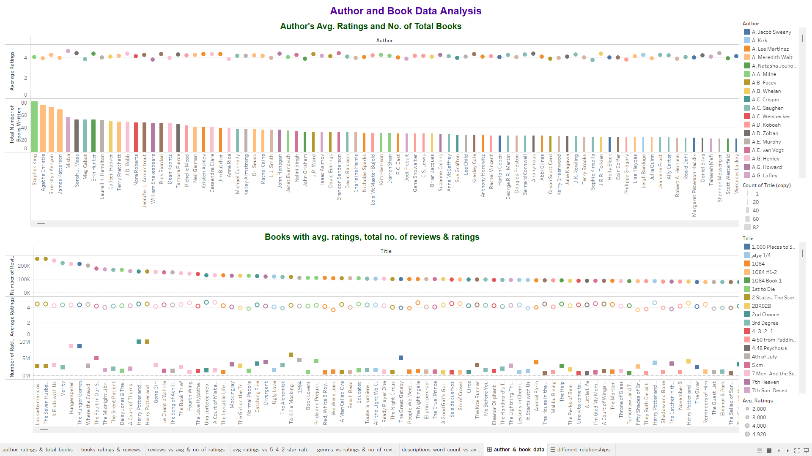
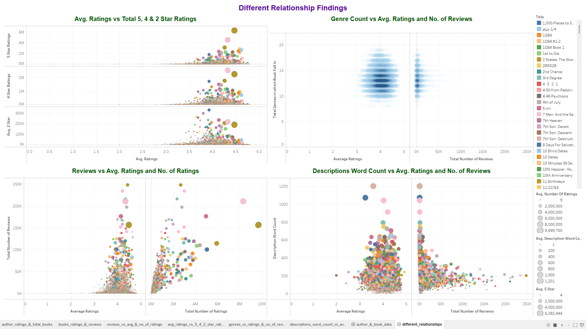

<h1>Goodreads Book Data Analysis</h1>

<h2>Project Development Journal</h2>

<h3><code style="color:blue">Problem Statement</code></h3>
<strong></strong>

<h3><code style="color:blue">Data Collection</code></h3>
<strong></strong>

<h3><code style="color:blue"><a href="https://public.tableau.com/app/profile/neloy.barman/viz/GoodreadsBookDataAnalysis/author__book_data">Analysis</a> Requirements Blueprint</code></h3>

* <strong>Find the average ratings and the number of books for each author based on the book data. Who is the top-rated author and who has published most books?</strong> 
* <strong>Books with the most number of reviews and average ratings.</strong>
* <strong>Find out the relationship of number of reviews with both the average ratings and the total number of ratings.</strong>
* <strong>Plot a relationship of the average ratings with the number of 5 star, 4 star and 2 star reviews.</strong>

<h3><code style="color:blue">DashBoard</code></h3>
<strong>You can find all the analysis within this <a href="https://public.tableau.com/app/profile/neloy.barman/viz/GoodreadsBookDataAnalysis/author__book_data">Tableau DashBoard</a></strong>

<h3><code style="color:blue">Analysis and Observations</code></h3>

<h4>i. Author and Book Data Analysis</h4>

* <strong>Top 5 authors with most avg. ratings based on book ratings: -</strong>
<table align="center">
    <tr align="center">
        <th>Author</th>
        <th>Avg. Ratings</th>
    </tr>
    <tr align="center">
        <td>Mustafa Kemal Atatürk</td>
        <td>4.81</td>
    </tr>
    <tr align="center">
        <td>Quino</td>
        <td>4.77</td>
    </tr>
    <tr align="center">
        <td>MsKingBean89</td>
        <td>4.753</td>
    </tr>
    <tr align="center">
        <td>Hayao Miyazaki</td>
        <td>4.75</td>
    </tr>
    <tr align="center">
        <td>Chanel Miller</td>
        <td>4.71</td>
    </tr>
</table>

* <strong>Top 5 authors with most no. of books and avg. ratings: -</strong>
<table align="center">
    <tr align="center">
        <th>Author</th>
        <th>No. of Books</th>
        <th>Avg. Ratings</th>
    </tr>
    <tr align="center">
        <td>Stephen King</td>
        <td>82</td>
        <td>4.022</td>
    </tr>
     <tr align="center">
        <td>Agatha Christie</td>
        <td>77</td>
        <td>3.902</td>
    </tr>
     <tr align="center">
        <td>Sherrilyn Kenyon</td>
        <td>73</td>
        <td>4.236</td>
    </tr>
     <tr align="center">
        <td>James Patterson</td>
        <td>69</td>
        <td>3.956</td>
    </tr>
     <tr align="center">
        <td>Misba</td>
        <td>57</td>
        <td>4.595</td>
    </tr>
</table>

<h4>ii. Different Kinds of Relationships Findings</h4>

